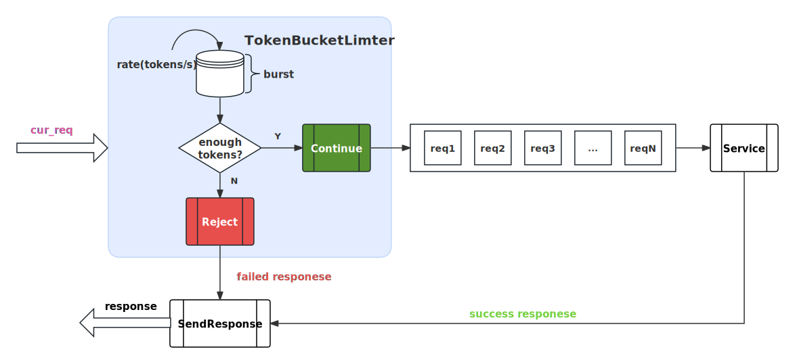
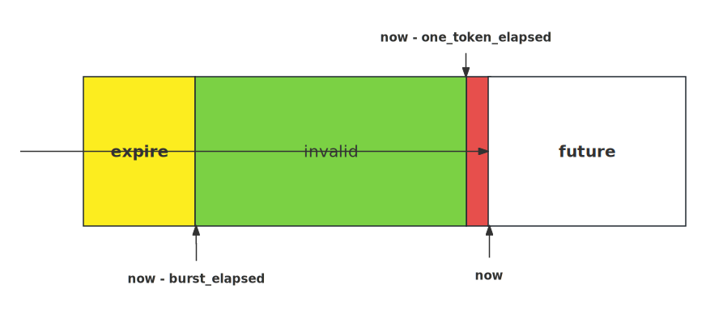

# 前言

tRPC-Cpp 框架应用于高并发的场景中，需要进行过载保护 ，以防业务程序出现不可预期的错误；虽然框架已经实现基于服务和方法的流控插件进行限流，但是该插件是运行在请求入队之后，不能及早进行过载保护； 本文主要介绍了一种基于令牌桶的过载保护插件，该插件运行在请求入队之前，实现策略简单易懂。

# 原理

## 基于令牌桶的过载保护原理图



图中核心点就是 `TokenBucketLimter` ，它的主要作用是获取框架当前的令牌桶大小（`burst`）以及用户配置的令牌生成速率（`rate`）。当令牌桶中有足够的令牌的时候，接收当前的请求（`cur_req`）；否则，拒绝当前的请求（`cur_req`）。

## 实现代码

如上图所示，令牌桶的实现似乎是这样：

维护一个定时器 Timer 和令牌桶对象 Bucket。Timer 以固定频率 `rate` 向 Bucket 存放 `token`，当  `token` 数量达到 `burst` 的时候， `token` 数不再增加；当请求到达的时候，减扣  `token`；当 `token` 数量为 0 时，拒绝请求。

上述做法虽然很直观，但是实现复杂，且效率低下，存在空跑维护  `token` 的情况。

针对上述问题，tRPC-Cpp 采用两种优化方式：

- 惰性求值

  所谓惰性求值是指在真正使用  `token` 的时候计算当前  `token` 的数量。基本思路如下：根据当前时间 `now` 与上一次分配令牌的时间 `last_alloc_time` 之差 `elapsed` 可以推算出桶内剩余令牌的数量 `token_cnt`。

  已知生成令牌的速度 `rate`（tokens/s），可求其倒数得到 `one_token_elapsed` （s/token），即生成一个令牌所需要的时间，根据  `burst` 可求出装满令牌桶所需时间为 `burst_elapsed` 。

  当  `elapsed` ≥ `burst_elapsed` 时，桶内剩余令牌数量 `token_cnt` 为  `burst` ；当 `elapsed` < `burst_elapsed` 时， `token_cnt` 为 `elapsed` /  `one_token_elapsed` 。

- 以时间为计算单位，而不是令牌

  根据上面的推导不难看出，在每次请求的时候都需要将  `elapsed` 映射为令牌数 `token_cnt`，需要做除法运算。此外，为了保证并发安全，我们需要锁来同时保护 `token_cnt ` 和 `last_alloc_time` 两个变量。 `token_cnt ` 和 `last_alloc_time` 存在简单的数学关系，实际上只需要维护 `last_alloc_time` 就可以了。在实现的时候也可以尽量减小锁的粒度。

  我们不妨以时间为单位分析：

  

  通过三个时间点 `now - burst_elapsed`、`now - one_token_elapsed`、`now` 将时间区间分为 4 个部分：

  - 当  `last_alloc_time` 处于黄色区域时，说明令牌早已满了，可以接收请求， `last_alloc_time` 应被视为  `now - burst_elapsed` 更新
  - 当  `last_alloc_time` 处于绿色区域时，说明令牌没满，可以接收请求， `last_alloc_time` 正常更新
  - 当  `last_alloc_time` 处于红色区域时，说明令牌不足1个，拒绝该请求
  - 当  `last_alloc_time` 处于白色区域时，异常情况，拒绝该请求

所谓更新是指在  `last_alloc_time` 的基础上增加 `one_token_elapsed`，表示消费一个令牌。

统一单位带来的好处是：避免时间和令牌数的相互转换，不光有性能开销（乘除运算），数据类型选择不当可能会导致溢出或者精度丢失。

源码参考：[token_bucket_overload_controller](../../trpc/overload_control/token_bucket_limiter/token_bucket_overload_controller.cc)

框架的过载保护实现方式是基于[过滤器](./filter.md)，为了保证尽可能早进行限流保护；该过滤器会埋点在请求入队前，具体埋点实现如下：

  ```cpp
std::vector<FilterPoint> ConcurrencyLimiterServerFilter::GetFilterPoint() {
  return {
      FilterPoint::SERVER_PRE_SCHED_RECV_MSG,
      // ...
  };
}
  ```

  源码参考：[concurrency_limiter_server_filter](../../trpc/overload_control/token_bucket_limiter/token_bucket_limiter_server_filter.cc)

# 使用示例

基于令牌桶的过载保护过滤器，**当前只能应用于服务端，客户端暂时不支持**，用户使用无需修改任何代码，只需开启编译和增加配置即可，非常方便。

## 编译选项

编译选项：在`.bazelrc` 文件中加入下面一行

```sh
build --define trpc_include_overload_control=true
```

## 配置文件

令牌桶过滤器配置如下（详细配置参考：[token_bucket_overload_ctrl.yaml](../../trpc/overload_control/token_bucket_limiter/token_bucket_overload_ctrl.yaml)）：

```yaml
#Global configuration (required)
global:
  local_ip: 0.0.0.0 #Local IP, used for: not affecting the normal operation of the framework, used to obtain the local IP from the framework configuration.

#Server configuration
server:
  app: test #Business name, such as: COS, CDB.
  server: helloworld #Module name of the business
  service: #Business service, can have multiple.
    - name: trpc.test.helloworld.Greeter #Service name, needs to be filled in according to the format, the first field is default to trpc, the second and third fields are the app and server configurations above, and the fourth field is the user-defined service_name.
      network: tcp #Network listening type: for example: TCP, UDP.
      ip: 0.0.0.0 #Listen ip
      port: 12345 #Listen port
      protocol: trpc #Service application layer protocol, for example: trpc, http.
      filter:
        - token_bucket_limiter

#Plugin configuration.
plugins:
  overload_control:
    token_bucket_limiter:
      burst: 50 # Maximum of burst size. It is configured small for unit testing purposes, but users can configure it to be larger.
      rate: 5 # Rate of token generation (tokens/second).
      is_report: true # Whether to report
```

配置关键点如下：

- token_bucket_limiter：令牌桶过载保护器的名称
- burst：为用户配置的令牌桶大小
- rate：为用户配置的令牌生成速率
- is_report：是否上报监控数据到监控插件，**注意，该配置必须与监控插件一起使用(例如配置：plugins->metrics->prometheus，则会上报到 prometheus 上)，如果没有配置监控插件，该选项无意义**，被监控数据有：
  - `remaining_tokens`：当前剩余的令牌数，属于动态值
  - `/{callee_name}/{method}`: 上报监控的 RPC 方法名，属于固定值；由被调服务(callee_name)和方法名(method)组成，例如：`/trpc.test.helloworld.Greeter/SayHello`。
  - `Pass`：单个请求的通过状态，0：拦截；1：通过
  - `Limited`：单个请求的拦截状态，1：拦截；0：通过。与上面的 `Pass` 监控属性是相反的

# FAQ